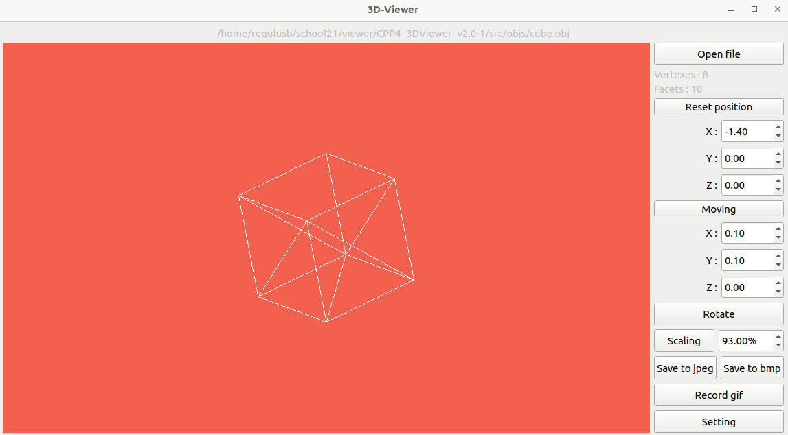
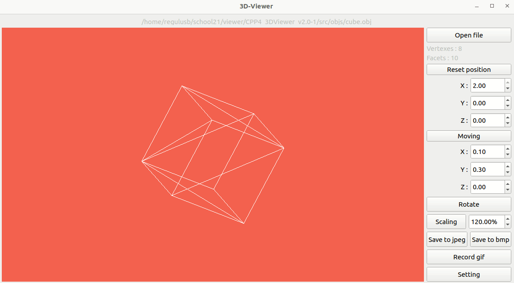

# 3DViewer_v2.0

<h1>Реализация обозревателя файлов .obj</h1>
<h2>Сборка</h2>
Для установки проекта на компьютере должны быть установлены зависимости:
- make
- gcc(g++)
- OpenGL
- CMake
- Qt6
- Qt6::Core
- Qt6::Gui
- Qt6::Widgets
- Qt6::OpenGLWidgets

Порядок действий для установки:
1. Скопируйте ссылку на [репозиторий](https://repos.21-school.ru/students/CPP3_SmartCalc_v2.0.ID_353536/kegsbett_student.21_school.ru/CPP3_SmartCalc_v2.0-1.git)
2. Склонируйте репозиторий и зайдите в папку src
3. Впишите в терминал `make` `install`

После установки на рабочем столе появится ярлык через который можно запустить приложение.

<h2>Работа приложения</h2>
Как только открыли приложение, нужно открыть файл нажав на кнопку **Open file** и выбрать файл с расширением ***.obj***:

**Пример открытия**

    

Далее объект можно фотографировать, записывать gif, поворачивать, перемещать и изменять размер. Эти действия можно делать либо с помощью мыши, либо через поля справа:

**Пример работы с объектом**

    

В приложении есть меню настроек над объектом:
- Проекция (парралельная, центральная)
- Цвет (фона, вершин, граней)
- Форма вершин (нет, сфера, куб)
- Тип facet (полигон, каркас)
- Тип граней каркаса (цельные, пунктирные)
- Размеры точек и граней

**Пример выбора настроек**

    

Для остальных целей понадобятся зависимости:
- GTest
- doxygen
- clang-format
- lcov

<h2>Остальные цели</h2>
- open_app (Открыть приложение)
- uninstall (Удалить приложение и ярлык)
- tests (Запустить тестирование модели)
- gcov_report (Собрать отчет об покрытия кода тестами)
- dist (Собрать архив с всем исходным кодом)
- dvi (Собрать html документацию с помощью doxygen)
- rebuild (clean - install - open_app)
- style (Проверка исходного кода на соответствие Google Style)
- clean (Очистить репозиторий от всех выше перечисленных выходных файлов)

